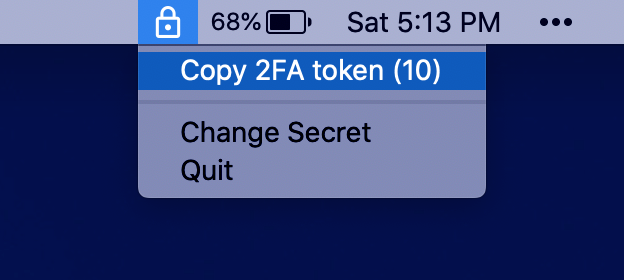
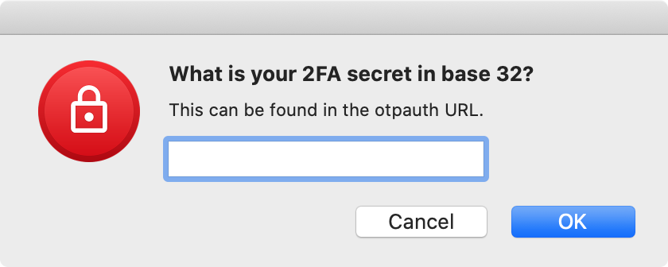

## Menu Bar 2FA

This is a simple MacOS app I made to practice Swift. It lives in the MacOS menu bar and copies TOTP codes to the clipboard when clicked. It only supports a single 2FA account at a time. TOTP secrets are stored in the keychain.

Want something that supports multiple 2FA accounts, or that works on Linux/Windows? Check out my 2FA chrome extension:
https://github.com/scottmangiapane/authenticator

## Screenshots




## How to find the 2FA secret

Time-based 2FA apps generate their tokens by combining a secret key (unique to the user of the website) and the current time. The secret key is usually embedded in a QR code that you scan with your phone. Unfortunately, *Menu Bar 2FA* doesn't know how to scan QR codes, so you will have to extract it yourself with one of the many existing [QR decoding tools](https://google.com/search?q=online+QR+code+decoder).

This gives you an [otpauth URL](https://github.com/google/google-authenticator/wiki/Key-Uri-Format), which will look like this:
```
otpauth://totp/Example:alice@google.com?secret=JBSWY3DPEHPK3PXP&issuer=Example
```

In this example, the base32 secret key is "JBSWY3DPEHPK3PXP".

## Download

The compiled version of this app can be downloaded from the [releases page](https://github.com/scottmangiapane/menu-bar-2fa/releases). It is not notarized (the Apple Developer Program is expensive!) so you will have to allow execution in `System Preferences > Security & Privacy > General`. If you want it to start automatically on login, you can do so in `System Preferences > Users & Groups > Login Items`.
