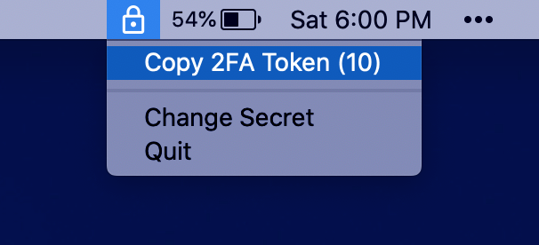

## Menu Bar 2FA

This is a simple MacOS app I made to practice Swift. It lives in the MacOS menu bar and copies TOTP codes to the clipboard when clicked. At the moment it only supports a single 2FA account at a time, but that could change in a future release. TOTP secrets are stored in the keychain.

## Screenshots

## Download

The compiled version of this app can be downloaded from the [releases page](https://github.com/scottmangiapane/menu-bar-2fa/releases). It is not notarized so you will have to allow execution in `System Preferences > Security & Privacy > General`. If you want it to start automatically on login, you can do so in `System Preferences > Users & Groups > Login Items`.
